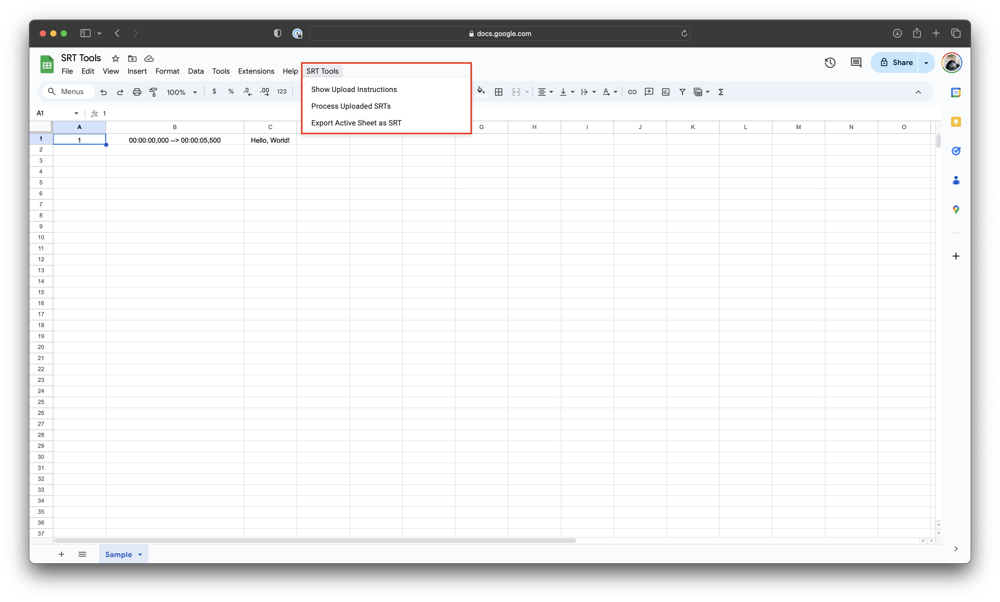
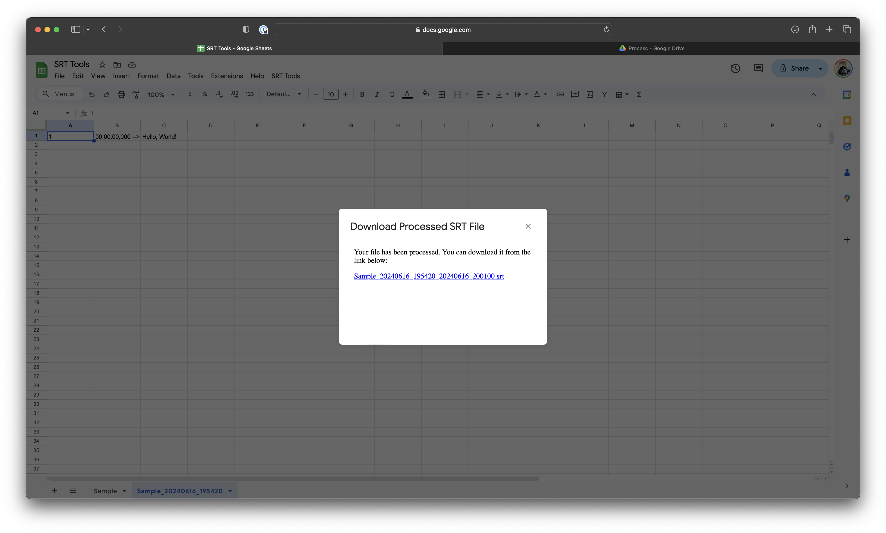

# srt-tools

## Getting Started

Follow the step-by-step tutorial below to learn how to set up and use the script to edit your existing SRTs in Google Sheets.

### Tutorial Steps

#### Step 1: Create a new document within Google Sheets.

#### Step 2: In the top bar, click "File" > "Import".

#### Step 3: Select "Upload" and then "Browse" to select your files.

#### Step 4: Import the "srt-tools.xlsx" template downloaded from this Repository.

#### Step 5: I would personally "Replace Current Spreadsheet" but ultimately this is up to you.

#### Step 6: Here's your template!

#### Step 7: Select from the top bar "Extensions" > "Apps Script"

#### Step 8: Here's your Apps Script interface.

#### Step 9: Navigate to "srt-tools.gs" within this Repository.

#### Step 10: Copy contents of "srt-tools.gs"

#### Step 11: Paste within your Apps Script and Save.

#### Step 12: Click "Run" to initialize your Apps Script.

#### Step 13: Authorization is required to allow your services within Google to access each other.

#### Step 14: Review and click "Allow" to continue once you've thoroughly reviewed and understand.

#### Step 15: Once you see this screen, you're all set and can return to Google Sheets.

#### Step 16: Refresh and you'll see this new custom menu option.

#### Step 17: Custom Menu Option - Show Upload Instructions

#### Step 18: Custom Menu Option - Process Uploaded SRTs

#### Step 19: Custom Menu Option - Export Active Sheet as SRT

#### Note: All of your files related to this will live in a directory called "SRT" on Google Drive. 

